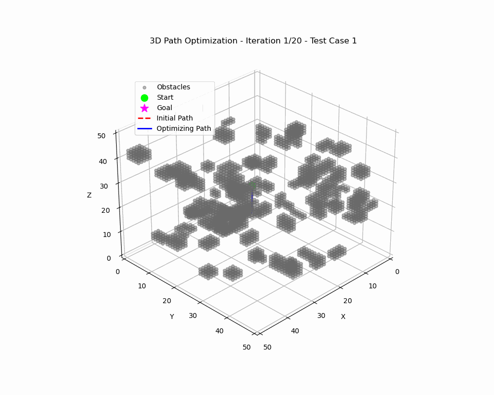

# SHIFT-Planner

[](https://fanzexuan.github.io/SHIFTPlanner/)
**Project Link:** [SHIFT-Planner](https://fanzexuan.github.io/SHIFTPlanner/)

<p align="center">
  
</p>
<p align="center">
  <em>Figure: SHIFT-planner algorithm architecture diagram.</em>
</p>


**SHIFT-Planner** is a holistic framework for robotic coverage, path planning, and real-time trajectory optimization in dynamic or large-scale environments. It integrates:

1. **IKD-Tree-based A\* Search Algorithms** for rapid pathfinding and obstacle avoidance.
2. **Potential Fields** for heuristic-driven obstacle avoidance.
3. **Segment-Based Trajectory Optimization** for local path refinement.
4. **3D Coverage Path Planning (3DCCP)** for aerial or uneven terrain applications.
5. **IKD-SWOpt** (Incremental KD-Tree with Sliding Window Optimization in C++).

<p align="center">
  

</p>

<p align="center">
  <em>Figure: Coverage path planning using the SHIFT-RFICP algorithm on a semantic map of arid hilly terrain.</em>
</p>

This repository accompanies our upcoming IROS paper, aiming to encourage further research, application, and community-driven enhancements.

> **Paper Citation:**
> 
> **"SHIFT Planner: Speedy Hybrid Iterative Field and Segmented Trajectory Optimization with IKD-tree for Uniform Lightweight Coverage"**  
> *Zexuan Fan, Sunchun Zhou, Hengye Yang, Junyi Cai, Ran Cheng, Lige Liu, Tao Sun*  
> **Target Conference:** IEEE/RSJ International Conference on Intelligent Robots and Systems (IROS 2025)  
> **Preprint Link:** [https://arxiv.org/abs/2412.10706](https://arxiv.org/abs/2412.10706)

---

## Table of Contents

- [SHIFT-Planner](#shift-planner)
  - [Table of Contents](#table-of-contents)
  - [Overview](#overview)
  - [Features](#features)
    - [Core Features of SHIFTPlanner (Python)](#core-features-of-shiftplanner-python)
    - [IKD-SWOpt (C++) Features](#ikd-swopt-c-features)
    - [2D-RFICP (Python) Features](#2d-rficp-python-features)
  - [Repository Structure](#repository-structure)
  - [Installation and Setup](#installation-and-setup)
    - [Python Environment Setup](#python-environment-setup)
    - [Building the C++ Components (IKD-SWOpt)](#building-the-c-components-ikd-swopt)
  - [Usage Guide](#usage-guide)
    - [SHIFTPlanner (Python)](#shiftplanner-python)
    - [IKD-SWOpt (C++)](#ikd-swopt-c)
    - [2D-RFICP (Python)](#2d-rficp-python)
      - [Usage Guide](#usage-guide-1)
    - [Experiments](#experiments)
  - [Code Descriptions](#code-descriptions)
    - [SHIFTPlanner Modules](#shiftplanner-modules)
      - [`kdtree_astar.py`](#kdtree_astarpy)
      - [`SHIFTplanner_PLANNER_TRJ_OPTIM.py`](#shiftplanner_planner_trj_optimpy)
      - [`SHIFTplanner-3DCCP.py`](#shiftplanner-3dccppy)
      - [`SHIFTplanner-SegmentTrjOptim.py`](#shiftplanner-segmenttrjoptimpy)
    - [IKD-SWOpt Modules](#ikd-swopt-modules)
      - [`IKD-SWOpt.cpp`](#ikd-swoptcpp)
      - [`ikd_Tree.cpp` \& `ikd_Tree.h`](#ikd_treecpp--ikd_treeh)
      - [`lbfgs.hpp`](#lbfgshpp)
    - [2D-RFICP Modules](#2d-rficp-modules)
      - [`SHIFTPlanner-2D-RFICP-Dynamic Algorithm Experiment.py`](#shiftplanner-2d-rficp-dynamic-algorithm-experimentpy)
      - [`SHIFTPlanner-2D-RFICP-Static Algorithm Experiment.py`](#shiftplanner-2d-rficp-static-algorithm-experimentpy)
  - [Visualizations](#visualizations)
    - [Pathfinding Examples](#pathfinding-examples)
    - [Coverage and Optimization Examples](#coverage-and-optimization-examples)
    - [Animation Examples](#animation-examples)
      - [Summary of the Process Demonstrated by the Animations:](#summary-of-the-process-demonstrated-by-the-animations)
    - [Current Release and Future Plans:](#current-release-and-future-plans)
  - [Results](#results)
  - [Citation](#citation)
  - [License](#license)
  - [Contributing](#contributing)
  - [Contact](#contact)

---

## Overview

**SHIFTPlanner** addresses the critical need for fast, adaptive, and robust path planning in robotic systems deployed in complex and changing environments. By integrating **Incremental KD-Trees** for dynamic obstacle handling, **potential fields** for heuristic guidance, and **sliding window optimization**, SHIFTPlanner ensures smooth, collision-free trajectories in real-time.

A core part of this repository is **IKD-SWOpt**, a C++ implementation of:

- **Incremental KD-Tree** for dynamic and high-dimensional obstacle management,
- **Sliding Window Optimization** for real-time trajectory smoothing and re-planning,
- **A\* Search** enhanced with potential fields for efficient pathfinding.

With both Python and C++ implementations available, **SHIFTPlanner** caters to a broad range of use cases—from quick prototyping in Python to high-performance C++ modules for production-level robotic systems.

---

## Features

### Core Features of SHIFTPlanner (Python)

1. **KD-Tree-Based A\* Search + Potential Fields**  
   Combines speed and accuracy by fusing KD-Trees with A\* and potential fields.

2. **Segment-Based Trajectory Optimization**  
   Locally refines path segments near obstacles for higher precision in cluttered spaces.

3. **3D Coverage Path Planning (3DCCP)**  
   Allows for uniform coverage of large-scale or uneven 3D terrains (e.g., UAV mapping).

4. **SciPy Optimization**  
   Integrates L-BFGS-B or other SciPy solvers for efficient trajectory refinement.

5. **Modular Design**  
   Each module (A\* planner, optimization, coverage) can be used independently or together.

### IKD-SWOpt (C++) Features

1. **Incremental KD-Tree**  
   Efficiently updates obstacle information in dynamic or partially known environments.

2. **Sliding Window Optimization**  
   Real-time local trajectory refinement using a lightweight optimization window.

3. **High-Performance A\* with Potential Fields**  
   Achieves fast pathfinding with advanced heuristics for obstacle avoidance.

4. **2D/3D Support**  
   Benchmarking in both 2D and 3D makes it applicable to ground robots, UAVs, or other robotic platforms.

5. **Extensive Visualization**  
   Outputs images and animations that illustrate planning and optimization processes.


### 2D-RFICP (Python) Features

1. **Dynamic Algorithm Experimentation**  
   Facilitates dynamic obstacle handling and real-time path adjustments using RFICP (Radiant Field-Informed Coverage Planning).

2. **Static Algorithm Experimentation**  
   Enables evaluation of path planning algorithms in static environments to benchmark performance.

3. **Comprehensive Simulation**  
   Includes simulation tools for dirt cleaning scenarios, showcasing practical applications of RFICP in 2D environments.

4. **Visualization Tools**  
   Provides visual feedback on algorithm performance, including dirty area maps and cleaning simulations.

---

## Repository Structure

```plaintext
SHIFTPlanner/
├── LICENSE                     # License file
├── README.md                   # Main project documentation (this file)
├── requirements.txt            # Python dependencies (optional for additional tools)
├── CMakeLists.txt              # Top-level CMake configuration for IKD-SWOpt
│
├── docs/
│   ├── IKD-SWOpt-Paper.pdf     # Research paper (placeholder or final PDF)
│   └── images/                 # Figures, diagrams, and animations
│       └── ...
├── src/
│   ├── IKD-SWOpt/
│   │   ├── CMakeLists.txt        # CMake configuration specific to IKD-SWOpt
│   │   ├── docs/
│   │   │   └── images/           # Additional documentation images (if any)
│   │   ├── include/
│   │   │   ├── Astar.h
│   │   │   ├── DistanceField.h
│   │   │   └── ikd_Tree.h        # KD-Tree header
│   │   ├── README.md             # IKD-SWOpt specific README
│   │   └── src/
│   │       ├── IKD-SWOpt.cpp      # Main executable
│   │       ├── ikd_Tree.cpp       # KD-Tree implementation
│   │       └── lbfgs.hpp          # Optimization library
│   │
│   ├── 2D-RFICP/
│   │   ├── SHIFTPlanner-2D-RFICP-Dynamic Algorithm Experiment.py
│   │   └── SHIFTPlanner-2D-RFICP-Static Algorithm Experiment.py
│   │
│   └── SHIFTPlanner/
│       ├── __init__.py
│       ├── kdtree_astar.py
│       ├── SHIFTplanner-3DCCP.py
│       ├── SHIFTplanner_PLANNER_TRJ_OPTIM.py
│       └── SHIFTplanner-SegmentTrjOptim.py
│ 
│
└── experiments/ (ongoing)         # Contains experiments, configs, results
    ├── figures/                    # Stores figures from experiment logs
    └── example_run_*.md            # Step-by-step instructions for replicating experiments
```

- **`docs/`**  
  - `images/`: Contains all figures and animations used in the documentation, organized into subdirectories for clarity.

- **`src/SHIFTPlanner/`**  
  Contains all the Python modules implementing the planning algorithms.
  - `__init__.py`: Initializes the SHIFTPlanner as a Python package.
  - `kdtree_astar.py`: Implements KD-Tree-based A\* search with potential fields.
  - `SHIFTplanner-3DCCP.py`: Handles 3D coverage path planning.
  - `SHIFTplanner_PLANNER_TRJ_OPTIM.py`: Integrates planning and trajectory optimization.
  - `SHIFTplanner-SegmentTrjOptim.py`: Manages segment-based trajectory optimization.

- **`src/IKD-SWOpt/`**  
  Contains the C++ implementation of the IKD-SWOpt algorithms.
  - `CMakeLists.txt`: CMake configuration specific to IKD-SWOpt.
  - `include/`: Header files for IKD-SWOpt.
    - `Astar.h`, `DistanceField.h`, `ikd_Tree.h`
  - `src/`: Source files for IKD-SWOpt.
    - `IKD-SWOpt.cpp`: Main executable.
    - `ikd_Tree.cpp`: KD-Tree implementation.
    - `lbfgs.hpp`: Optimization library.
  - `docs/`: Additional documentation for IKD-SWOpt.
    - `images/`: (Optional) Additional images if needed.
  - `README.md`: IKD-SWOpt specific README.
- **`src/2D-RFICP/`**  
  Python scripts for dynamic and static algorithm experiments.
- **`experiments/`**  
  Contains experiment configurations, results, and additional documentation.
  - `figures/`: Stores generated figures from experiments.
  - `example_run_*.md`: Markdown files detailing example runs and their outcomes.

---

## Installation and Setup

### Python Environment Setup

1. **Clone the Repository**

   ```bash
   git clone https://github.com/YourUserName/SHIFTPlanner.git
   cd SHIFTPlanner
   ```

2. **Create a Virtual Environment (Optional but Recommended)**

   Using `venv`:

   ```bash
   python -m venv shiftplanner_env
   source shiftplanner_env/bin/activate  # On Windows: shiftplanner_env\Scripts\activate
   ```

   Using `conda`:

   ```bash
   conda create -n shiftplanner_env python=3.9
   conda activate shiftplanner_env
   ```

3. **Install Python Dependencies**

   ```bash
   pip install -r requirements.txt
   ```

   *If using conda, you can set up an environment file.*

### Building the C++ Components (IKD-SWOpt)

1. **Ensure Required Dependencies**

   - **C++ Compiler**: GCC 9.0 or higher recommended.
   - **CMake**: Version 3.10 or later.
   - **Libraries**:
     - [OpenCV](https://opencv.org/) (for visualization)
     - [Eigen3](https://eigen.tuxfamily.org/) (for matrix operations)
     - `lbfgs.hpp` (included in `src/IKD-SWOpt/src/` for optimization)

2. **Build IKD-SWOpt**

   ```bash
   cd src/IKD-SWOpt
   mkdir build
   cd build
   cmake ..
   make
   ```

   **Note:** Ensure that the `CMakeLists.txt` file is correctly placed in the `src/IKD-SWOpt/` directory as per the repository structure.

3. **Verify Installation**

   - **SHIFTPlanner**: Ensure that Python scripts run without errors.
   - **IKD-SWOpt**: Check that the `IKD-SWOpt` executable is generated in the `build/` directory.

---

## Usage Guide

### SHIFTPlanner (Python)

1. **Navigate to SHIFTPlanner Directory**

   ```bash
   cd src/SHIFTPlanner/
   ```

2. **Run Modules**

   ```bash
   python kdtree_astar.py
   python SHIFTplanner_PLANNER_TRJ_OPTIM.py
   python SHIFTplanner-3DCCP.py
   python SHIFTplanner-SegmentTrjOptim.py
   ```

   Each script performs its designated function, such as path planning, optimization, or visualization, and may generate plots and console outputs.

### IKD-SWOpt (C++)

1. **Navigate to the Build Folder**

   ```bash
   cd src/IKD-SWOpt/build
   ```

2. **Run the Executable**

   ```bash
   ./IKD-SWOpt
   ```

   The executable performs the following:

   - **Environment Generation**: Creates random environments with specified obstacle densities.
   - **Pathfinding**: Utilizes A\* search enhanced with potential fields to determine optimal paths.
   - **Trajectory Optimization**: Applies sliding window optimization using B-splines and L-BFGS for smooth trajectories.

   **Outputs Include**:

   - **Visualization Windows**: Display paths and optimized trajectories.
   - **Saved Images**: Automatically saves visualizations for each test case in the working directory.

### 2D-RFICP (Python)

#### Usage Guide

1. **Navigate to 2D-RFICP Directory**

    ```bash
    cd src/2D-RFICP/
    ```

2. **Run Dynamic Algorithm Experiment**

    ```bash
    python SHIFTPlanner-2D-RFICP-Dynamic Algorithm Experiment.py
    ```

3. **Run Static Algorithm Experiment**

    ```bash
    python SHIFTPlanner-2D-RFICP-Static Algorithm Experiment.py
    ```

4. **Visual Outputs**

    - Dirt cleaning simulations.
    - Dirty area maps visualizing algorithm performance.


### Experiments

Refer to the `experiments/` directory for detailed experiment setups and example runs. Each `example_run_*.md` provides step-by-step instructions and results for specific scenarios.

---

## Code Descriptions

### SHIFTPlanner Modules

#### `kdtree_astar.py`

Implements a KD-Tree-based A\* search algorithm enhanced with potential fields to facilitate obstacle avoidance. The module builds a KD-Tree from obstacle coordinates for efficient nearest-neighbor queries, calculates a distance field, and performs A\* search considering both path cost and potential field influences.

#### `SHIFTplanner_PLANNER_TRJ_OPTIM.py`

Serves as the main integrated planner and trajectory optimizer. It combines random obstacle generation, A\* pathfinding with potential fields, and trajectory optimization using SciPy's L-BFGS-B algorithm. The script also includes visualization of the initial and optimized paths.

#### `SHIFTplanner-3DCCP.py`

Handles 3D coverage path planning suitable for aerial drones and robots operating in uneven terrains. It generates random 3D terrains, constructs Triangulated Irregular Networks (TIN), and performs A\* search in 3D space while considering obstacles. The module visualizes the terrain, obstacles, and planned paths in 3D plots.

#### `SHIFTplanner-SegmentTrjOptim.py`

Focuses on segment-based trajectory optimization. It identifies path segments near obstacles and optimizes them locally to refine the overall path. The script includes animation functions to visualize the iterative optimization process and integrates optimized segments back into the main path.

### IKD-SWOpt Modules

#### `IKD-SWOpt.cpp`

The main executable for the IKD-SWOpt component. It initializes the planning framework, generates random environments, performs pathfinding using A\* with potential fields, and optimizes trajectories using sliding window optimization.

#### `ikd_Tree.cpp` & `ikd_Tree.h`

Implements the Incremental KD-Tree data structure for efficient management and querying of dynamic obstacles in high-dimensional spaces. The KD-Tree supports real-time updates, insertions, and deletions, making it suitable for dynamic environments.

#### `lbfgs.hpp`

A header-only library implementing the Limited-memory Broyden–Fletcher–Goldfarb–Shanno (L-BFGS) optimization algorithm. It is used for trajectory optimization within the sliding window framework to ensure smooth and feasible robot paths.

### 2D-RFICP Modules

#### `SHIFTPlanner-2D-RFICP-Dynamic Algorithm Experiment.py`

Conducts dynamic algorithm experiments using the **2D-RFICP** framework. This script simulates obstacle environments and evaluates the algorithm's performance in real-time path adjustment and obstacle avoidance.

#### `SHIFTPlanner-2D-RFICP-Static Algorithm Experiment.py`

Performs static algorithm experiments within the **2D-RFICP** framework. This script assesses the path planning and coverage performance in static obstacle environments, providing baseline metrics for comparison.


---

## Visualizations

**SHIFTPlanner** and **IKD-SWOpt** provide extensive visualizations to illustrate planning processes and trajectory optimizations. Below are examples of the types of visualizations available. Replace the placeholders with your actual files as needed.

### Pathfinding Examples

<p align="center">
  
  
</p>
<p align="center">
  <em>Figure: The coarse A* path generated using the IKD-tree and its corresponding distance field representation.</em>
</p>


<p align="center">
  
  
</p>

<p align="center">
  
  
</p>

<p align="center">
  
  
</p>

<p align="center">
  
  
</p>

<p align="center">
  
  
</p>

### Coverage and Optimization Examples

<p align="center">
  
  
</p>
<p align="center">
  <em>Figure: Optimization process of trajectory segments within the sliding window of the IKD-SWOpt framework.</em>
</p>

<p align="center">
  
  
</p>

<p align="center">
  
  
</p>


<p align="center">
  <em>Figure: Velocity Planning Algorithm Based on 2D/3D-RFICP and Semantic Maps.</em>
</p>


<p align="center">
  
  
</p>

<p align="center">
  
  
</p>

<p align="center">
  <em>Figure: Trajectory planning visualization using the SHIFT Planner framework.</em>
</p>

### Animation Examples

<p align="center">
  
  
</p>
<p align="center">
  <em>Figure: Optimization process based on the IKD-Tree.</em>
</p>


<p align="center">
  
  
</p>
<p align="center">
  <em>Figure: Demonstration of the IKD-SWOpt algorithm in 3D environments for obstacle avoidance and path optimization.</em>
</p>


<p align="center">
  
  
</p>

<p align="center">
  
  
</p>
<p align="center">
  <em>Figure: Visualization and optimization process of the distance field map based on the IKD-SWOpt algorithm.</em>
</p>


<p align="center">
  
  
</p>

<p align="center">
  
  
</p>
<p align="center">
  <em>Figure: Visualization of the trajectory optimization process for segments detected by the sliding window in the SHIFT algorithm.</em>
</p>


<p align="center">
  
</p>
<p align="center">
  <em>Figure: Optimization process for 2D obstacle-avoidance trajectory segments.</em>
</p>
<p align="center">
  
</p>
<p align="center">
  <em>Figure: 2D-SHIFTPlanner Coverage Planning Process, 2D-RFICP Dirty Removal Cleaning Simulation.</em>
</p>

#### Summary of the Process Demonstrated by the Animations:

The animations highlight the **Incremental IKD-tree Sliding Window Optimization (IKD-SWOpt)** approach, designed for real-time obstacle avoidance and trajectory refinement in dynamic environments. Here's an overview of the process:

1. **Dynamic Obstacle Detection**:  
   When the planned path encounters obstacles, the **Circular Judgment and Assessment Module** continuously scans within a defined circular detection window. Regions of the path that violate the cost function (e.g., collision risks) are flagged.

2. **Adaptive Sliding Window Optimization**:  
   Identified problematic path segments are incorporated into an **Adaptive Sliding Window**. Within this localized window, the path is iteratively optimized using IKD-SWOpt, ensuring smooth and collision-free trajectories.

3. **Iterative Refinement**:  
   The framework continues to refine the trajectory until a feasible path is achieved, avoiding unnecessary computational overhead by only activating optimization when required.

4. **Superior Performance**:  
   Extensive experiments with drones and robotic vacuum cleaners in real-world scenarios validate the method's effectiveness. The approach achieves:
   - **Efficient Coverage**: Uniform and thorough area traversal.
   - **Dynamic Adaptability**: Real-time obstacle avoidance and re-planning.
   - **Computational Efficiency**: Optimization is performed selectively, reducing system load.

---

### Current Release and Future Plans:

This repository currently includes:
- **Python implementations** of core functionalities, focusing on pathfinding, trajectory optimization, and experimental visualization.
- **Experimental results** showcasing the proposed framework's performance across diverse environments.

**Planned Updates**:
- Incremental release of additional Python modules, including detailed scripts for trajectory optimization and real-time obstacle avoidance.
- Further visualization assets and experimental results.

This phased release strategy ensures accessibility to the community while maintaining high-quality documentation and reproducibility.

**Note**: Some advanced features, including full IKD-SWOpt integration for 3D environments, will be made available in future updates.


---

## Results

1. **Pathfinding Performance**  
   Demonstrates low collision rates, short paths, and fast computations in cluttered 2D and 3D environments.

2. **3D Coverage**  
   Shows uniform coverage on random 3D terrains, validated with metrics like coverage percentage vs. flight path length.

3. **Segment-Based Optimization**  
   Illustrates local path refinements near obstacles through animated optimizations, significantly reducing collisions in complex corridors.

4. **IKD-SWOpt**  
   Achieves real-time re-planning in dynamic environments with moving obstacles, ensuring smooth, collision-free trajectories.

5. **2D-RFICP**
     Demonstrated robust performance in environments with moving obstacles.Provided baseline metrics for path planning efficiency and coverage.
    
  Extensive experiments conducted with drones and robotic vacuum cleaners in complex real-world environments validate the effectiveness of our approach. The proposed framework demonstrates superior coverage performance and adaptability compared to existing methods, achieving efficient, uniform, and obstacle-aware trajectories suitable for autonomous systems operating in dynamic environments.


Refer to the `experiments/example_run_*.md` files for reproducible experiments and performance graphs.

---

## Citation

If you use **SHIFTPlanner** or **IKD-SWOpt** in your academic work, please consider citing:

```bibtex
@inproceedings{fan2025shiftplanner,
  title={SHIFT Planner: Speedy Hybrid Iterative Field and Segmented Trajectory Optimization with IKD-tree for Uniform Lightweight Coverage},
  author={Fan, Zexuan and Zhou, Sunchun and Yang, Hengye and Cai, Junyi and Cheng, Ran and Liu, Lige and Sun, Tao},
  booktitle={Proceedings of IEEE/RSJ International Conference on Intelligent Robots and Systems (IROS)},
  year={2025}
}
```

---

## License

This project is licensed under the [MIT License](LICENSE). You are free to use, modify, and distribute it as long as you retain the original license and attribution notices.

---

## Contributing

Contributions, bug reports, and feature requests are highly welcome! Please:

1. **Fork** this repository.
2. **Create a new branch** (`git checkout -b feature/new-awesome-feature`).
3. **Commit** your changes.
4. **Submit a pull request** to the **main** branch.

We appreciate community engagement to refine and extend SHIFTPlanner.

---

## Contact

For inquiries, feedback, or support, please reach out via email:

- **Zexuan Fan**  
  [mail to FanZexuan](fanzexuan135@163.com)  

**Project Link:** [SHIFTPlanner](https://fanzexuan.github.io/shiftplanner/) (demo pages, updates, and documentation)

---

**Notes:**

- The most critical **Radiant Field-Informed Coverage Planning (RFICP) algorithm, speed planning code based on semantic maps**, as discussed in the paper, will be open-sourced in a future update.
---

**Happy Planning!**  

<p><strong>© 2025 SHIFTPlanner Team. All rights reserved.</strong></p>
